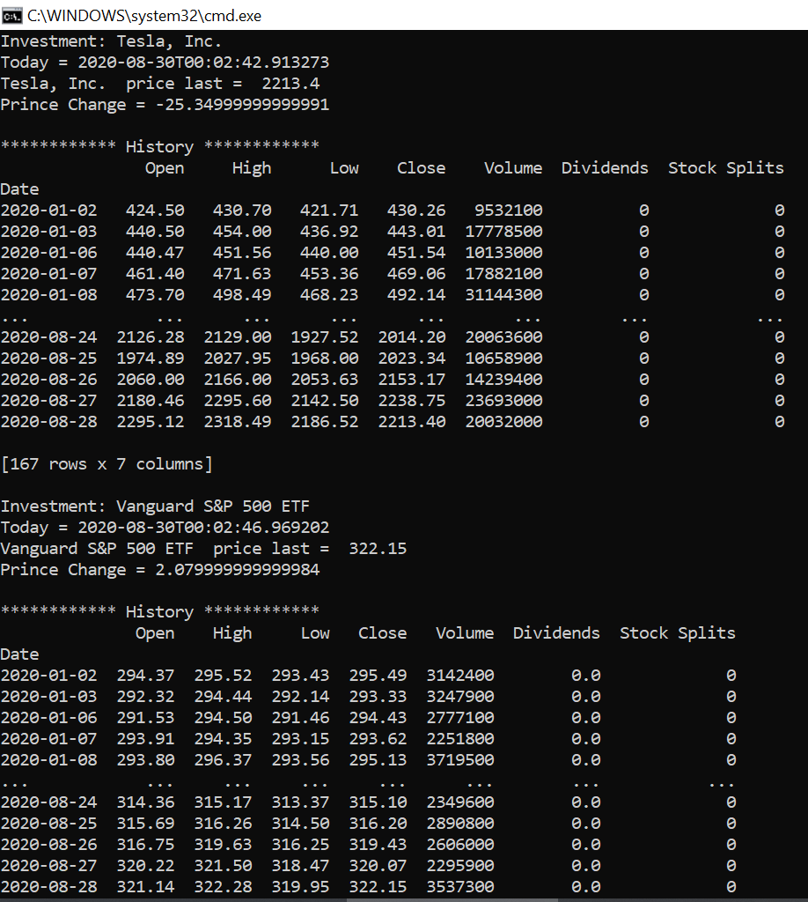

# yfinance-python
## Description:
This program was made in python. It's gets datas about financial market used "yahoo finance"

## Prerequisite
* Python 3.8.3

## Install:
```
	pip install yfinance --upgrade --no-cache-dir
```

## To run it:
```
	python yahoo.py
```
## Evidece use:


## In case errors:
### Error: Python: ImportError: lxml not found, please install it
```
	pip3 install lxml
```

## 
[GitHub](http://github.com)
https://pypi.org/project/yfinance/